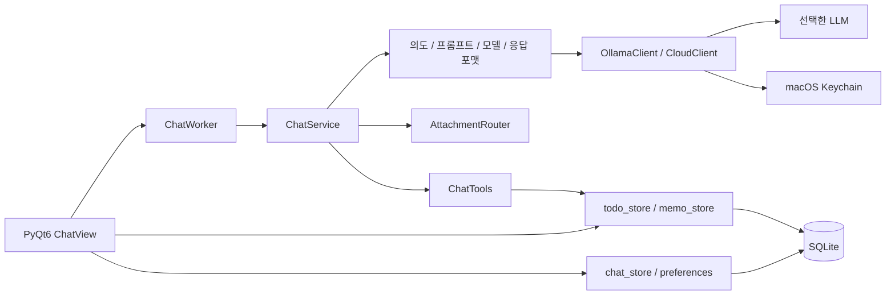

# Myorii

macOS 메뉴바에서 채팅, 할일, 메모를 여는 Python 데스크톱 컴패니언.

## 메뉴바에서 이어지는 작업

작업 중 작은 팝오버에서 모델에 질문하고, 답변의 코드나 이름을 복사하고, 필요한 내용을 메모로 남긴다. 대화 모델은 Ollama 또는 OpenAI·Gemini·Anthropic API 중 선택한다. 할일과 메모는 SQLite에 저장하며 채팅에서도 추가·조회·수정·삭제할 수 있다.

이 README는 실행 코드가 있는 `dev` 기준이다. `main`은 소개 문서만 있는 브랜치이며 Windows 실행기는 아직 구현하지 않았다.

- `QSystemTrayIcon` 클릭으로 창을 열고 닫는다. `QLockFile`로 중복 실행을 막는다.
- 워커 thread가 응답을 받아 Qt signal로 화면에 전달한다. 네이밍·코드 등 일부 응답은 포맷 정리를 위해 버퍼링한다.
- 이미지와 문서 첨부를 모델 요청에 넣는다. 문서는 형식별 handler가 읽을 수 있는 텍스트·표본만 추출한다.
- 채팅 기록 저장을 선택하고 세션·할일·메모의 순서를 재정렬한다.
- `/todo `, `/memo ` 태그 또는 자연어로 로컬 저장소를 다룬다. 대상이 모호하면 후보 ID를 보여주고, 모델 응답을 기다리는 사이 바뀐 내용을 덮어쓰지 않는다.
- 테마·언어·모델 선택은 SQLite, 외부 API 키는 macOS Keychain에 저장한다.

## 요청이 지나가는 경로



의도에 따라 프롬프트와 응답 표현을 바꾸며 모델은 설정에서 선택한 모델을 유지한다. 로컬 도구 요청은 모델의 JSON 계획을 검증한 뒤 저장소에 적용한다. 일반 채팅과 파일 첨부, 저장소 변경의 상세 경계는 [아키텍처](docs/architecture.md)와 [라우터 설계](docs/router-design.md)에 있다.

## 기술과 코드 위치

| 역할 | 기술 / 코드 |
|---|---|
| 데스크톱 UI | PyQt6, `ui/`, `platform/macos/menubar.py` |
| LLM 요청 | Ollama Python client, urllib 기반 cloud client, `core/llm/` |
| 로컬 데이터 | sqlite3, `storage/`, `core/paths.py` |
| 첨부 파싱 | pypdf, pdfminer.six, 표준 XML/ZIP 처리, `core/llm/attachments/` |
| macOS 연결 | PyObjC, keyring macOS backend |
| 번들 | PyInstaller, `packaging/macos/Myorii.spec` |
| 회귀 테스트 | unittest, `tests/` |

`prompts/`는 공통·의도별 프롬프트, `core/tools/`는 채팅으로 저장소를 다루는 코드다. `docs/`는 개발 규칙, UI 가이드, 기존 로드맵과 수동 테스트를 보관한다.

## macOS 개발 실행

Python 3.12 이상과 메뉴바를 표시할 데스크톱 세션이 필요하다. `requirements.txt`에 macOS PyObjC 의존성이 있다.

```bash
python3 -m venv .venv
source .venv/bin/activate
python -m pip install -r requirements.txt
ollama pull qwen3-vl:4b-instruct
ollama serve
```

Ollama가 실행된 상태에서 다른 터미널로 앱을 실행한다. 이미 Ollama 서비스가 켜져 있으면 다시 `serve`할 필요는 없다.

```bash
source .venv/bin/activate
python main.py
```

외부 API를 사용할 경우 설정에서 제공자·키·모델을 선택한다. `.env` 파일로 API 키를 받는 구조는 아니다. 이미지 입력 가능 여부와 모델 접근 권한은 선택한 제공자·모델에 달려 있다.

```bash
QT_QPA_PLATFORM=offscreen python -m unittest discover -s tests -p 'test_*.py'
PYINSTALLER_CONFIG_DIR=/tmp/myorii_pyinstaller .venv/bin/pyinstaller packaging/macos/Myorii.spec --noconfirm --clean
open -n dist/Myorii.app
```

테스트에는 재현 응답을 사용하는 제공자 검증이 포함된다. 통과 결과가 실제 계정 API 호출이나 패키지 배포 성공을 의미하지는 않는다.

## 데이터와 현재 범위

DB는 `~/Library/Application Support/Myorii/myorii.db`에 생성된다. 대화·첨부 경로·할일·메모·설정을 보관한다. 외부 API 모드에서는 대화와 첨부 내용이 해당 제공자에게 전송된다. 로컬 모델 모드는 Ollama를 사용한다.

PDF OCR, 오피스 서식·차트 해석, 전체 스프레드시트 계산은 구현 범위가 아니다. 시작 시 자동 실행 스위치는 UI만 있다. Windows, 동기화, 외부 도구 연결의 계획은 [기존 로드맵](docs/roadmap.md)에 따로 남겨 둔다.

[사용 예와 첨부 범위](docs/USAGE.md) · [수동 테스트](docs/manual-test-cases.md) · [개발 규칙](docs/development-rule.md)
