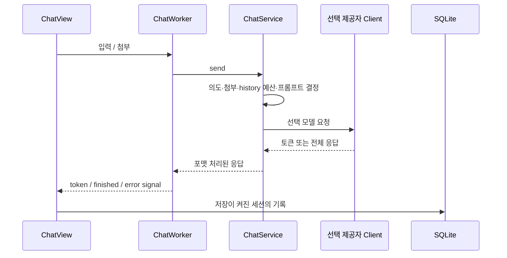

# Myorii의 현재 실행 구조

`dev`의 `main.py`는 macOS `MacMenuBar`를 직접 import한다. Windows tray 자동 분기나 서버 프로세스는 없다. GUI, LLM 처리, SQLite 저장이 한 애플리케이션 안에 있다.

## 시작과 thread

`QApplication` → `QLockFile` → `database.initialize()` → `MainWindow` → `MacMenuBar` 순으로 시작한다. 마지막 창을 닫아도 앱을 종료하지 않고 메뉴바에 남는다. `ChatWorker`, `ModelListWorker`, `ModelWarmupWorker`가 Python thread에서 모델 작업을 수행하고 Qt signal로 결과를 알린다.

## 대화

`ChatService`는 일반 요청의 최근 완결된 대화를 입력 예산에 맞춘다. 이전 발언을 지칭하지 않는 네이밍·번역에는 관계없는 history를 제외한다. 추출한 첨부 맥락은 `model_content`로 저장·복원하며, 사라진 원본은 경고 맥락을 남긴다. `ResponseFormatter`가 필요한 의도는 전체 응답을 받은 후 정리한다.

## 로컬 도구

`core/tools/chat_tools.py`는 `/todo `·`/memo `와 자연어 요청을 감지해 모델로 JSON 계획을 만든다. action·target·ID·내용을 검증한 뒤 `todo_store`·`memo_store`의 함수를 호출한다. 수정·삭제는 하나의 대상을 식별해야 한다. store의 `update_if_unchanged`·`delete_if_unchanged`가 snapshot과 현재 row를 비교해 대기 중 변경을 보호한다. 이것은 로컬 저장소 도구이며 MCP 구현이 아니다.

## 저장

| 테이블 | 역할 |
|---|---|
| `preferences` | 테마·언어·제공자별 모델 선택 |
| `chat_sessions` | 제목과 순서, 생성·갱신 시간 |
| `chat_messages` | role, 표시 내용과 migration으로 추가되는 model_content |
| `chat_attachments` | 메시지에 연결된 로컬 파일 경로·MIME |
| `todos` | 본문, 완료 여부, 순서, 시간 |
| `memos` | 제목·본문·순서·시간 |

`database.py`는 연결마다 WAL과 foreign key를 켜고 commit/rollback 후 닫는다. 세션·메시지 관계의 삭제는 cascade를 사용한다. DB 경로는 `core/paths.py`의 macOS Application Support 경로다. 첨부 파일 자체를 DB blob이나 클라우드에 업로드해 저장하지 않는다.

API 키는 `model_store`가 `keyring.backends.macOS.Keyring`으로 읽고 쓴다. SQLite에는 키 대신 모델 선택을 저장한다. `CloudClient`는 OpenAI Responses, Gemini streamGenerateContent, Anthropic Messages 요청과 스트리밍 해석을 구현한다. 앱이 공개 HTTP API를 제공하는 구조는 아니다.

## 첨부와 계획의 경계

형식별 파싱·사용 예는 [USAGE](USAGE.md), 의도·profile·formatter 상세는 [router-design](router-design.md)을 본다. `DeviceContext`, `SyncMetadata`는 확장을 위한 계약이다. 해당 dataclass가 존재한다고 동기화 서비스가 구현된 것은 아니다. `platform/windows/`도 현재 Windows tray 실행기가 없다.

## 코드 근거

[main.py](../main.py) · [ChatWorker](../ui/chat_worker.py) · [ChatService](../core/llm/chat_service.py) · [ChatTools](../core/tools/chat_tools.py) · [database](../storage/database.py) · [model_store](../storage/model_store.py)
