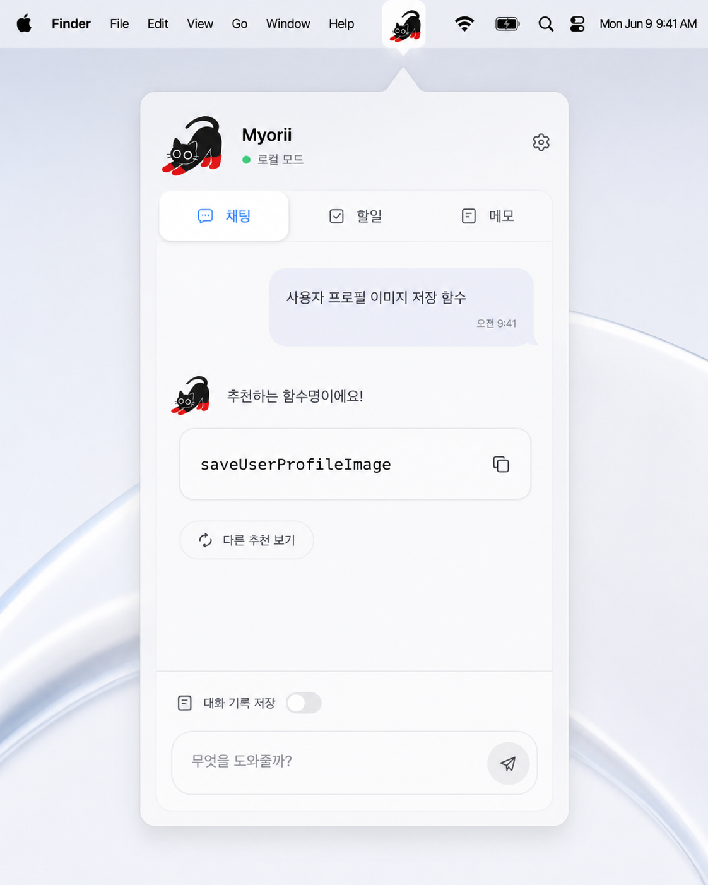
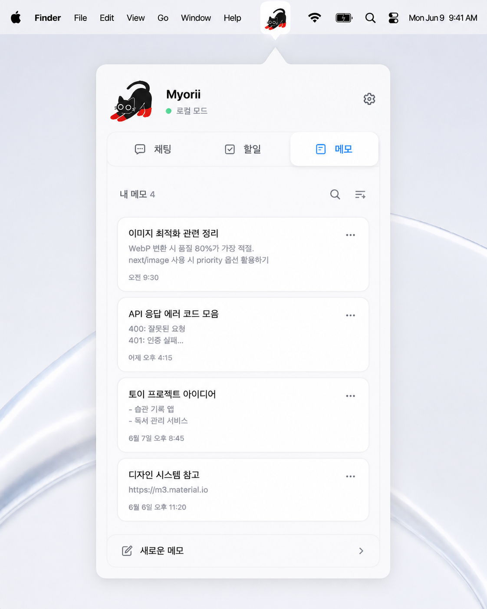
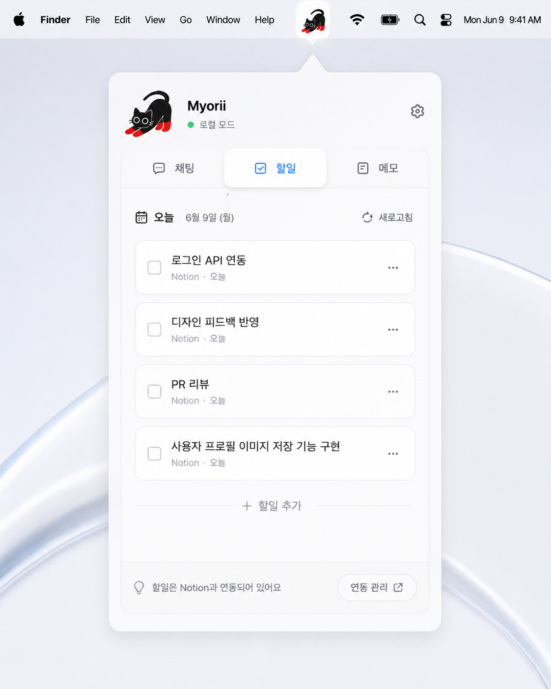
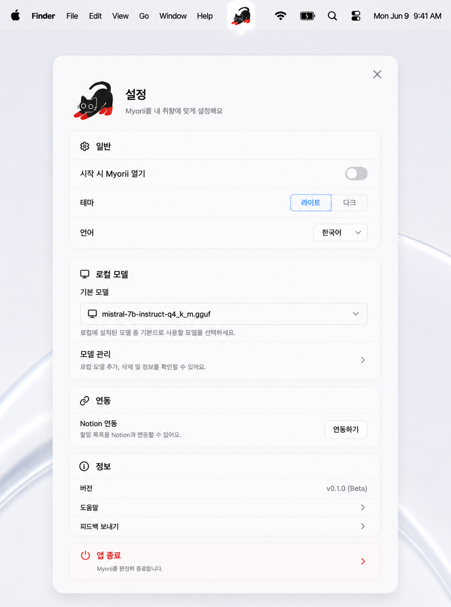

# 🎨 UI Guide

Myorii의 UI 설계 기준 및 화면 구성을 정의한다.

---

# 디자인 컨셉

## 키워드

* Apple Inspired
* Glassmorphism
* Minimal
* Lightweight
* Companion

---

## 디자인 목표

Myorii는 생산성 도구이지만 생산성 앱처럼 보이지 않는다.

작은 고양이 친구가 메뉴바에 살면서 사용자의 작업을 돕는 경험을 제공한다.

복잡한 기능보다 빠른 접근성과 직관성을 우선한다.

---

# 캐릭터 컨셉

## Myorii

검은 고양이

빨간 장화

동글동글한 실루엣

---

## 상태 표현

### Idle

* 눈 깜빡임

### Thinking

* 꼬리 흔들기

### Success

* 기뻐하는 반응


---

# 디자인 시스템

## Design Style

Apple Inspired Glassmorphism

---

## Color Strategy

화이트 기반

차분한 블루 포인트

---

## Background

#FFFFFF

---

## Accent

Myorii Blue

(개발 단계에서 최종 확정)

---

## Radius

20~24px

---

## Shadow

Soft Apple Style Shadow

---

## Typography

SF Pro (macOS)

Segoe UI (Windows)

Pretendard (Fallback)

---

# 화면 구조

## 메뉴바

### 목적

앱 진입점

### 기능

* 아이콘 클릭 시 창 열기
* 다시 클릭 시 창 닫기

현재 단계에서는 별도의 Open Myorii 메뉴를 사용하지 않는다.

### 캐릭터

Myorii 아이콘 사용

---

# 메인 창

### 구조

```text
┌────────────────────┐
│   Header           │
├────────────────────┤
│ Chat | Todo│ Memo  │
├────────────────────┤
│                    │
│ Content Area       │
│                    │
├────────────────────┤
│ Input Area         │
└────────────────────┘
```

### 현재 구현 범위

* 메뉴바 아래에 표시되는 둥근 글래스 팝오버 외곽
* 상단 포인터, 화이트 기반 반투명 배경, 소프트 섀도우
* Header: 축소된 Myorii 캐릭터, 앱 이름 옆 온라인/오프라인 상태, 설정 아이콘
* Tab: 채팅, 할일, 메모 3개 탭
* Content Area: 선택된 탭에 맞는 화면 표시
* Chat Area: 사용자/Assistant 메시지 버블과 스트리밍 응답 표시
* Input Area: 첨부파일 액션, 대화 기록 저장 스위치, 텍스트 입력, 전송 버튼

현재 단계의 할일 탭은 로컬 저장, 체크 완료, 드래그 재정렬, 새 할 일 추가를 지원한다. 메모 탭은 로컬 저장, 목록/편집 화면 전환, 자동 저장, 삭제, 드래그 재정렬, Markdown 입력을 지원한다.

### 상태 표시

인터넷 연결 상태에 따라 Header 상태가 변경된다.

* 온라인: 초록색 점과 `온라인` 라벨
* 오프라인: 빨간색 점과 `오프라인` 라벨

상태 표시는 앱 이름과 같은 줄에 배치하여 채팅 영역의 세로 공간을 확보한다.

### 탭 동작

채팅, 할일, 메모 탭은 3개 중 1개만 선택된다.

선택된 탭은 파란색 텍스트와 아이콘으로 표시한다.

아이콘 색상은 별도 에셋을 추가하지 않고 코드에서 tint 처리한다.

---

# 채팅 화면

## 목업



---

## 목적

기본 진입 화면

---

## 주요 기능

* 일반 채팅
* 네이밍
* 이미지 분석

---

## UI 구성

### Header

* Myorii 캐릭터
* 설정 버튼
* `×` 닫기 버튼

### Chat Area

* 사용자 메시지는 우측 파란 버블로 표시
* Assistant 메시지는 좌측 흰 버블과 Myorii 아바타로 표시
* 메시지 버블은 채팅 영역 폭에 맞춰 반응형으로 넓어진다
* Assistant 응답은 스트리밍 중 일반 텍스트로 누적
* Assistant 응답 완료 후 Markdown으로 렌더링
* 코드블록은 모노스페이스와 연한 배경으로 표시
* 코드블록, 인라인 코드, 파일명/함수명/변수명/명령어 후보는 클릭 시 복사되고 `복사됨` 토스트 표시
* Assistant 응답 대기 중에는 빨간 발바닥 3개가 순차로 튀는 인디케이터 표시
* 메시지 목록 영역만 스크롤
* 입력 영역은 하단에 고정

### Input Area

* 텍스트 입력
* `+` 버튼 파일 선택
* 입력부 드래그 앤 드롭 파일 첨부
* 첨부 파일 미리보기 카드
* 전송 버튼
* 채팅 기록 버튼
* 대화 기록 저장 스위치
* `Enter`: 전송
* `Shift+Enter`: 줄바꿈
* 긴 텍스트 자동 줄바꿈
* 입력 내용이 여러 줄이 되면 입력창 높이 제한 내에서 확장

첨부 파일은 `jpg`, `jpeg`, `png`, `txt`, `md`, `csv`, `tsv`, `json`, `yaml`, `yml`, `pdf`, `doc`, `docx`, `hwp`, `hwpx`, `xls`, `xlsx`, `ppt`, `pptx` 등 확장자 기반으로 선택, 드롭, 미리보기를 지원한다. 지원하지 않는 파일을 선택하거나 드롭하면 Assistant 메시지 영역에 지원하지 않는 파일 형식 오류를 표시한다.

현재 모델 입력까지 실제 본문을 전달하는 첨부 형식은 이미지 파일이다. `TextHandler`는 `txt`, `md`, `json`, `yaml`, `yml` 본문 일부를 추출할 수 있지만 아직 요청 경로에는 연결하지 않았다. 문서, 스프레드시트, 프레젠테이션은 UI 첨부와 파일명 전달까지만 구현되어 있으며, 본문 파싱과 요약 전달은 후속 `AttachmentRouter` 단계에서 구현한다.

첨부 파일 미리보기 카드는 입력창 바로 위에 표시한다. 이미지 파일은 썸네일을 보여주고, 문서 파일은 확장자 배지를 보여준다. 파일명이 길 경우 카드 폭에 맞춰 끝부분을 말줄임 처리한다.

사용자가 첨부 파일과 함께 메시지를 전송하면 첨부 파일명은 파란 메시지 버블 본문에 섞지 않고, 사용자 메시지 버블 상단 바깥에 낮은 대비의 파란 톤 미리보기 카드로 표시한다. 카드가 한 줄 폭을 넘으면 가로 스크롤 없이 다음 줄로 이어진다.

---

## UX 원칙

* 앱 시작 시 기본 진입 화면
* 입력창 항상 하단 고정
* 코드 블록 원클릭 복사
* 여러 후보는 후보별 코드블록으로 분리해 개별 복사
* 하나의 코드 스니펫이나 셸 스크립트는 하나의 코드블록으로 유지해 전체 복사
* 설명, 주의점, 적용 위치 안내는 코드블록 밖 채팅 문장으로 표시
* 실제 채팅 내용은 라우터가 선택한 Ollama 모델 응답으로 렌더링
* 헤더와 탭은 채팅 공간 확보를 위해 compact하게 유지

---

# 할일 화면

## 목적

오늘 처리할 작업을 메뉴바 팝오버 안에서 빠르게 확인하고 정리한다.

## UI 구성

### Header

* 달력 아이콘
* `오늘` 라벨
* 현재 날짜와 요일

### Todo List

* 할 일 카드는 흰 배경, 8px radius, 얇은 border로 표시
* 왼쪽부터 드래그 핸들, 체크박스, 텍스트 순서로 배치
* 긴 텍스트는 카드 폭에 맞춰 줄바꿈
* 완료 체크 시 로컬 DB에 완료 상태를 저장하고 목록에서 제거
* 드래그 완료 시 현재 UI 순서를 SQLite `ord` 값으로 다시 저장

### Add Bar

* `+ 할일 추가` 버튼으로 입력창 전환
* Enter 입력 시 새 할 일 저장
* 취소 버튼으로 입력 상태 종료

## 구현 메모

macOS 투명 팝오버와 `QScrollArea` 조합에서는 카드 단위 `QGraphicsOpacityEffect`가 렌더 위치와 마우스 hitbox를 어긋나게 만들 수 있다. 할일 카드는 카드 자체 opacity effect를 사용하지 않는다.

---

# 메모 화면

## 목업



---

## 목적

빠른 메모 저장

---

## 주요 기능

* 메모 작성
* 메모 수정
* 메모 삭제
* 자동 저장
* Markdown 서식 입력
* 드래그 재정렬

---

## UI 구성

### 메모 목록

* 메모 카드는 제목, 본문 미리보기, 수정 시간을 표시한다.
* 본문 미리보기는 카드 폭 기준 최대 2줄로 말줄임 처리하여 날짜와 겹치지 않는다.
* 카드 좌측의 6-dot 핸들을 드래그해 순서를 변경한다.
* 카드 우측 `x` 버튼으로 메모를 삭제한다.
* 메모 카드를 클릭하면 해당 메모 편집 화면으로 들어간다.

### 메모 편집

* 새로운 메모를 클릭하면 전체 영역이 입력부로 전환된다.
* 입력 내용은 짧은 지연 후 자동 저장된다.
* 첫 번째 의미 있는 줄을 목록 제목으로 사용한다.
* Markdown 원문은 SQLite에 저장하고, 편집 화면에서는 서식을 즉시 시각화한다.

### Markdown 입력

* `#`, `##`, `###` 뒤 Space: 대/중/소제목
* `*`, `-`, `+` 뒤 Space: 글머리 목록
* `[]` 또는 `[ ]` 뒤 Space: 체크박스 항목
* `1.` 뒤 Space: 번호 목록
* `"` 뒤 Space: 인용 블럭
* `**텍스트**`: 굵게
* `*텍스트*`: 기울임
* `` `텍스트` ``: 인라인 코드
* `~텍스트~`: 취소선
* fenced code block 내부에서 `Enter`는 블럭을 닫고 밖으로 이동하며, `Shift+Enter`는 블럭 내부 줄바꿈을 유지한다.

### 새 메모 버튼

하단 고정

---

## UX 원칙

* 한 번의 클릭으로 메모 생성
* 복잡한 폴더 구조 없음
* Markdown 마커는 입력 직후 가능한 한 서식으로 전환해 Notion에 가까운 작성감을 제공

---

# 할일 화면 (V2)

## 목업



---

## 목적

Notion 할일 관리

---

## 주요 기능

* 오늘의 할일 표시
* 완료 체크
* Notion 동기화

---

## UI 구성

### Todo List

체크박스 기반

### 상태 표시

* 완료
* 진행 중

---

## UX 원칙

* Notion을 열 필요 없음
* 오늘 해야 할 일만 표시

---

# 설정 화면

## 목업



---

## 목적

앱 환경 설정

---

## 주요 기능

### 일반

```text
시작 시 Myorii 열기
라이트 / 다크
한국어 / 영어
```

---

### 로컬 모델

```text
기본 모델 선택 드롭다운
모델 관리 버튼
```

---

### 연동

```text
Notion 연동 버튼
```

---

### 정보

```text
임시 버전
도움말 버튼
피드백 보내기 버튼
```

---

### 앱 종료

설정 화면의 앱 종료 버튼은 실제로 Myorii를 종료한다.

---

## 현재 구현 범위

* 기본 채팅창 Header의 설정 아이콘을 클릭하면 설정 화면으로 이동한다.
* 설정 화면의 닫기 버튼을 클릭하면 기본 채팅창으로 돌아간다.
* 시작 시 Myorii 열기는 실제 스위치 버튼으로 배치되어 있다.
* 테마는 라이트와 다크 중 하나를 선택하는 토글 버튼으로 배치되어 있다.
* 언어는 한국어와 영어 중 하나를 선택하는 토글 버튼으로 배치되어 있다.
* 기본 모델 선택은 Ollama 설치 모델을 표시하며, `qwen3-vl:4b`를 첫 항목으로 고정한다.
* 모델 관리, 연동하기, 도움말, 피드백 보내기 버튼은 추후 기능 연결 예정이다.
* 앱 종료 버튼만 실제 종료 동작에 연결되어 있다.

## 추후 UI 튜닝 예정

설정 화면의 전체 폰트 크기, 섹션 간격, 행 높이, 아이콘과 글자 사이 간격, 버튼 모양과 상태 표현은 추후 한 번 더 조정한다.

---

# 창 동작 규칙

## macOS

메뉴바 아이콘 클릭

↓

아이콘 바로 아래 팝업

↓

다시 클릭 시 닫힘

창이 열릴 때 현재 작업 화면을 강제로 전환하지 않는다.

앱 종료는 설정 화면에서 제공한다.

---

## Windows

시스템 트레이 클릭

↓

아이콘 바로 위 팝업

↓

다시 클릭 시 닫힘

---

# 반응형 규칙

## 최소 크기

```text
430 × 610
```

---

## 최대 크기

고정 크기 사용

사용자 리사이즈 비활성화

---

# 에셋 구조

```text
assets/
├── icons/
│   ├── menubar_icon.png
│   ├── chat.png
│   ├── check.png
│   ├── memo.png
│   ├── settings.png
│   └── send.png
│
├── characters/
│   └── myorii_profile.png
│
└── mockups/
    ├── myorii.png
    ├── chat.png
    ├── memo.png
    ├── todo.png
    └── settings.png
```

---

# UI 원칙

## 1. 빠른 접근

항상 1~2번의 클릭 안에 기능 도달

---

## 2. 단순성

설정보다 사용을 우선

---

## 3. 일관성

모든 화면 동일한 레이아웃 사용

---

## 4. 컴패니언 경험

AI 비서가 아닌 작은 고양이 친구처럼 느껴져야 한다.
